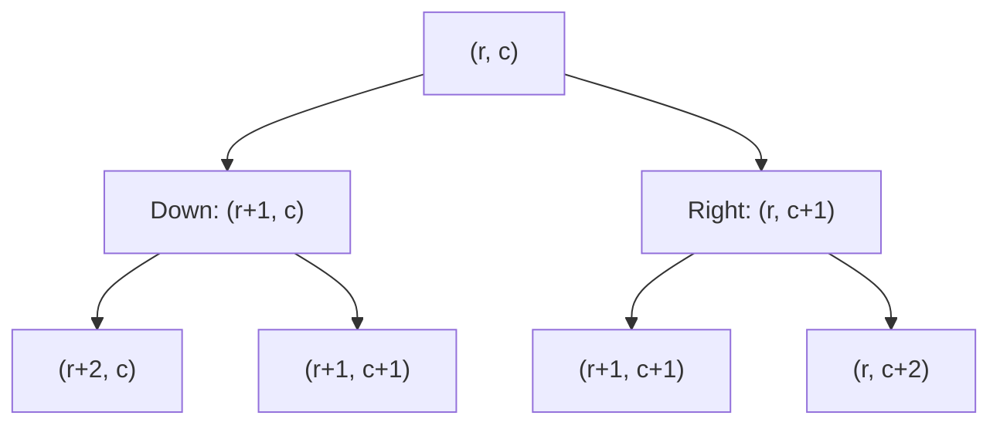

# 62. Unique Paths (with Grid Obstacles)

**Difficulty:** Medium 🟡  
**LeetCode:** [Link](https://leetcode.com/problems/unique-paths/)  
**Category:** Dynamic Programming / Grid DFS  
**Date Solved:** Aug 16, 2026  
**Time Spent:** 50 mins

---

## 📝 Problem Definition & Core Concept

You are placed at the top-left corner `(0,0)` of a grid and need to reach the bottom-right corner `(m-1, n-1)`. You can **only move Down or Right** at any given step. 

We want to calculate the **total number of unique, valid paths** to the destination.

---

## 🌳 1. The Decision Tree Model

From any cell `(r, c)`, you face a binary choice:
1. Move **Down** to `(r+1, c)`
2. Move **Right** to `(r, c+1)`

This generates a branching decision tree:



> [!IMPORTANT]
> Notice that `(r+1, c+1)` is reached from **both** branches. Without optimization, our program will recompute this state (and its entire subtree) multiple times! This is why pure recursion is too slow ($O(2^{m+n})$).

---

## 🛑 2. The 3 Stopping Conditions (Base Cases)

Our recursive function must check 3 critical conditions in order:

### 1️⃣ Out of Bounds
```java
if (r == grid.size() || c == grid.get(0).size()) {
    return 0; 
}
```
* **Explanation:** Indexing is 0-based. If rows = 2 and columns = 3:
  * Valid rows: `0, 1`
  * Valid columns: `0, 1, 2`
* If `r == 2`, you fell out through the bottom. If `c == 3`, you walked off the right edge.
* **Why return 0?** This path is invalid (dead end). It contributes `0` to the total path count.

```
   c=0   c=1   c=2
 ┌─────┬─────┬─────┐
 │  S  │     │     │  r=0
 ├─────┼─────┼─────┤
 │     │     │  E  │  r=1
 └─────┴─────┴─────┘
                     → [c=3] ❌ OUT OF BOUNDS!
```

---

### 2️⃣ Obstacle Hit
```java
if (grid.get(r).get(c).equals("X")) {
    return 0;
}
```
* **Explanation:** Cell `(r, c)` contains an obstacle symbol `"X"`.
* **Why return 0?** You cannot pass through walls. Any route hitting this cell terminates with `0` successful paths.

---

### 3️⃣ Reached Destination
```java
if (r == grid.size() - 1 && c == grid.get(0).size() - 1) {
    return 1;
}
```
* **Explanation:** You have reached the bottom-right target cell.
* **Why return 1?** You successfully completed exactly **1 valid path**. This leaf returns `1`, which gets added back up the decision tree.

---

## ⚡ 3. The Recurrence Relation

If none of the stopping conditions trigger, we explore both possibilities and sum them:

$$\text{paths}(r, c) = \text{paths}(r+1, c) + \text{paths}(r, c+1)$$

In code:
```java
return countPath(r + 1, c, grid) + countPath(r, c + 1, grid);
```
*"The total paths from this cell is the sum of paths if I step Down plus the paths if I step Right."*

---

## 🧩 4. Memoization (Top-Down DP)

To prevent computing the same cell again, we use a 2D cache table `dp[r][c]`.
* Initialize all values to `-1`.
* `-1` means the state has not been calculated yet.
* Before running recursive calls, check:
```java
if (dp[r][c] != -1) {
    return dp[r][c]; // Return cached answer instantly!
```
* Store result upon calculation:
```java
dp[r][c] = countPath(r + 1, c) + countPath(r, c + 1);
return dp[r][c];
```

---

## 🛡️ 5. Special Case: Forcing Exactly 2 Paths in a 3×3 Grid

In a normal $3 \times 3$ grid with no obstacles, the total paths to the destination is:

$$\binom{\text{Downs} + \text{Rights}}{\text{Downs}} = \binom{2+2}{2} = 6 \text{ paths}$$

### Placing a Wall to get exactly 2 paths
If we place a single obstacle `"X"` in the center cell `(1,1)`, we block all paths running through the center.

Let's calculate the blocked paths:
* Paths from Start `(0,0)` to Center `(1,1)` = $\binom{1+1}{1} = 2$
* Paths from Center `(1,1)` to End `(2,2)` = $\binom{1+1}{1} = 2$
* Blocked paths = $2 \times 2 = 4$ paths.

Remaining valid paths:
$$6 - 4 = 2 \text{ paths}$$

```
    c=0   c=1   c=2
 ┌─────┬─────┬─────┐
 │  S  │  .  │  .  │  r=0
 ├─────┼─────┼─────┤
 │  .  │  X  │  .  │  r=1    <-- Center Blocked!
 ├─────┼─────┼─────┤
 │  .  │  .  │  E  │  r=2
 └─────┴─────┴─────┘
```

#### The 2 Surviving Paths:
1. **Top-Right Path:** `(0,0) → (0,1) → (0,2) → (1,2) → (2,2)` (Moves: **Right, Right, Down, Down**)
2. **Left-Bottom Path:** `(0,0) → (1,0) → (2,0) → (2,1) → (2,2)` (Moves: **Down, Down, Right, Right**)

Any other path will attempt to hit `(1,1)` and immediately return `0`.

---

## 📊 6. Comparison of Approaches

| Approach | Time Complexity | Space Complexity | Status | Pros/Cons |
|----------|-----------------|------------------|--------|-----------|
| **1. Brute Recursion** | $O(2^{m+n})$ | $O(m+n)$ | ❌ TLE | Very slow due to duplicate computations. |
| **2. Memoization (Top-down DP)** | $O(m \times n)$ | $O(m \times n)$ | ✅ Accepted | Simple to convert from recursion. |
| **3. Tabulation (Bottom-up DP)** | $O(m \times n)$ | $O(m \times n)$ | ✅ Accepted | Iterative, no recursive call stack overhead. |
| **4. Space-Optimized DP** | $O(m \times n)$ | $O(n)$ | ✅ Accepted | Best memory usage (uses 1D array). |
| **5. Math Combinatorics** | $O(m)$ or $O(n)$ | $O(1)$ | ✅ Accepted | Fastest, but **cannot** handle obstacles. |

---

## 🚨 Troubleshooting & Common Bugs

1. **Off-by-One in Destination Check:**
   * ❌ `r == grid.size() && c == grid.get(0).size()` (Out of bounds!)
   * ✅ `r == grid.size() - 1 && c == grid.get(0).size() - 1`

2. **Mixing up C++ and Java Syntax:**
   * ❌ `grid[r][c] == 'X'` on a `List<List<String>>`
   * ✅ `grid.get(r).get(c).equals("X")`

3. **Compiler mismatch on Coding Platforms:**
   * If you see: `fatal error: module 'java.util.List' not found`
   * Ensure your selector is set to **Java** instead of **C++**.

---

**Status:** ✅ SOLVED | **Attempts:** 3 | **Best Approach:** Approach 4 — Space-Optimized 1D DP (No Obstacles) / Approach 2.1 (Obstacles)
